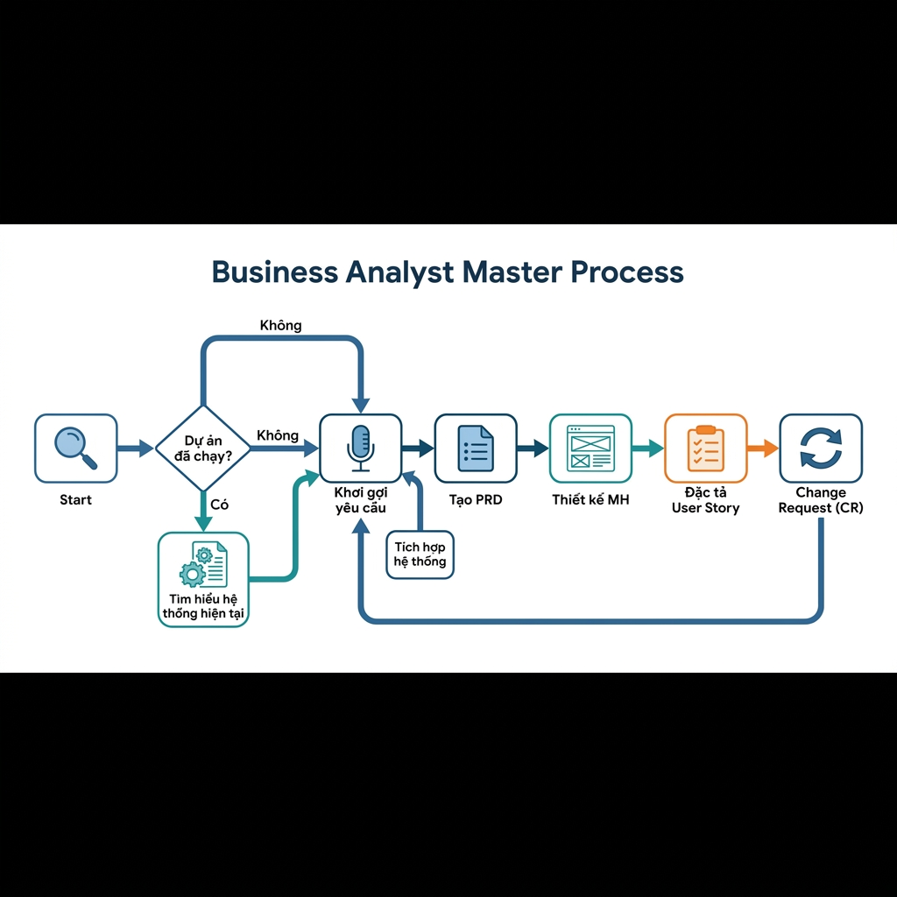

# Quy Trình Tổng Quan Nghiệp Vụ Business Analyst (E2E)

Tài liệu này cung cấp cái nhìn toàn cảnh về vòng đời phát triển yêu cầu nghiệp vụ, từ khi tiếp nhận hệ thống/yêu cầu cho đến khi bàn giao hồ sơ đặc tả chi tiết và xử lý các thay đổi phát sinh.

## 1. Sơ đồ quy trình tổng quan

Dưới đây là luồng tương tác giữa các giai đoạn chính trong dự án:

1. **Tìm hiểu hệ thống hiện tại**: Dành cho các dự án bảo trì/nâng cấp (Brownfield). *Lưu ý: Có thể bỏ qua bước này nếu dự án mới hoàn toàn (Greenfield).*
2. **Khơi gợi yêu cầu**: Thu thập nhu cầu từ các Stakeholder thông qua phỏng vấn và tài liệu.
3. **Tích hợp hệ thống**: Phân tích các điểm chạm kỹ thuật với đối tác bên thứ ba (API, Data Mapping).
4. **Tạo PRD**: Thành lập hồ sơ giải pháp tổng thể (AS-IS/TO-BE).
5. **Thiết kế màn hình (Prototype)**: Trực quan hóa giải pháp.
6. **Đặc tả User Story**: Chi tiết hóa kỹ thuật cho từng chức năng.
7. **Change Request (CR)**: Xử lý và cập nhật các thay đổi, sau đó quy trình lặp lại từ bước phân tích ảnh hưởng.

## 2. Bản đồ hướng dẫn chi tiết (Manual Index)

Để thực hiện từng giai đoạn, vui lòng truy cập vào các hướng dẫn chi tiết tương ứng (được sắp xếp theo đúng thứ tự thực hiện):

| STT | Giai đoạn | Tài liệu hướng dẫn | Mục tiêu chính |
| :-- | :--- | :--- | :--- |
| 01 | **Tìm hiểu HT hiện tại** | [01-ba-hdsd-tim-hieu-he-thong-hien-tai.md](01-ba-hdsd-tim-hieu-he-thong-hien-tai.md) | Phân tích Data Model để hiểu hệ thống cũ. |
| 02 | **Khơi gợi yêu cầu** | [02-ba-hdsd-khoi-goi.md](02-ba-hdsd-khoi-goi.md) | Phỏng vấn Stakeholder và tóm tắt yêu cầu. |
| 03 | **Phân tích Tích hợp** | [03-ba-hdsd-tich-hop-he-thong.md](03-ba-hdsd-tich-hop-he-thong.md) | Phân tích API đối tác và luồng dữ liệu E2E. |
| 04 | **Giải pháp tổng thể** | [04-ba-hdsd-gap-analysis-prd.md](04-ba-hdsd-gap-analysis-prd.md) | Xây dựng tài liệu PRD từ kết quả khơi gợi. |
| 05 | **UI/UX & Frontend** | [05-ba-hdsd-tao-prototype.md](05-ba-hdsd-tao-prototype.md) | Xây dựng Design System và Mockup chuẩn. |
| 06 | **Đặc tả kỹ thuật** | [06-ba-hdsd-dac-ta-user-story.md](06-ba-hdsd-dac-ta-user-story.md) | Viết UI Spec, Sequence và Activity Rules. |
| 07 | **Quản lý thay đổi** | [07-ba-hdsd-change-request.md](07-ba-hdsd-change-request.md) | Phân tích tác động và cập nhật đồng bộ tài liệu. |

## 3. Bảng Tổng Hợp Công Cụ Toàn Quy Trình

Dưới đây là danh sách toàn bộ các Skill và Workflow được sử dụng xuyên suốt các giai đoạn:

### Giai đoạn 1: Tìm hiểu hệ thống hiện tại
| Tên Công Cụ | Loại | Mục đích | Đầu vào | Đầu ra mong muốn |
| :--- | :--- | :--- | :--- | :--- |
| `ba-system-overview-datamodel` | Skill | Tổng quan hệ thống AS-IS | Data Model (SQL/Schema), Tên HT, Mục đích, DS ứng dụng, DS đối tượng | Tài liệu System Overview PRD |
| `ba-user-story-spec` | Workflow | Đặc tả chi tiết chức năng | System Overview, Data Model, Ảnh MH từng US | Bộ hồ sơ User Story hoàn chỉnh |

### Giai đoạn 2: Khơi gợi yêu cầu
| Tên Công Cụ | Loại | Mục đích | Đầu vào | Đầu ra mong muốn |
| :--- | :--- | :--- | :--- | :--- |
| `ba-elicitation-process` | **Workflow** | Quản lý quy trình khơi gợi khép kín | Chat, tài liệu stakeholder, ghi chú họp | Updated Tracking (kèm Q&A), Req. Summary, Elicitation History |
| `ba-elicitation-qna-gen` | Skill | Tạo câu hỏi khơi gợi | Thông tin yêu cầu đã có | Danh sách câu hỏi (MD/Docx) |
| `ba-elicitation-review` | Skill | Review chất lượng khơi gợi | Requirement Summary | Báo cáo đánh giá (8 tiêu chí) |
| `ba-stakeholder-doc-analysis` | Skill | Phân tích tài liệu khách hàng | PDF, Docx, Hình ảnh | Phân tích Entity, E2E Flow |
| `ba-elicitation-result-update` | Skill | Cập nhật kết quả khơi gợi | Meeting notes, files, chat | Updated Tracking List, Req Summary |
| `strategic-domain-explorer` | Skill | Khám phá Domain mới | Tên Domain/Ngành | Business Model, ERD High-level |

### Giai đoạn 3: Phân tích Tích hợp
| Tên Công Cụ | Loại | Mục đích | Đầu vào | Đầu ra mong muốn |
| :--- | :--- | :--- | :--- | :--- |
| `ba-integration-spec` | Skill | Phân tích gọi API đối tác | API Doc đối tác, Data Model, List Epics & US | Luồng tích hợp E2E |
| `ba-partner-api-analyze` | Skill | Thiết kế API cho đối tác | Nhu cầu tích hợp | Danh sách API cần mở |

### Giai đoạn 4: Tạo PRD & Giải pháp
| Tên Công Cụ | Loại | Mục đích | Đầu vào | Đầu ra mong muốn |
| :--- | :--- | :--- | :--- | :--- |
| `/ba-prd-create` | Workflow | Tạo PRD hoàn chỉnh | File Summary Khơi gợi | Tài liệu PRD tổng thể |
| `ba-process-proposal` | Skill | Thiết kế giải pháp TO-BE | Phân tích AS-IS | Mô tả quy trình đề xuất |
| `ba-usecase-list-gen` | Skill | Phân tích list Use Case | Summary khơi gợi yêu cầu, Quy trình đề xuất | Master Use Case List |
| `ba-erd-gen` | Skill | Thiết kế mô hình dữ liệu | Summary khơi gợi yêu cầu, Quy trình đề xuất | ERD Mermaid, Data Dictionary |
| `ba-doc-generator` | Skill | Xuất tài liệu chuyên nghiệp | Nội dung PRD | File PRD (.docx/.md) |

### Giai đoạn 5: Prototype & UI/UX
| Tên Công Cụ | Loại | Mục đích | Đầu vào | Đầu ra mong muốn |
| :--- | :--- | :--- | :--- | :--- |
| `ba-planning` | Skill | Tracking tiến độ thiết kế | List User Story | `ba-development-tracking.md` |
| `ba-brand-prompt-gen` | Skill | Gen prompt Design System | Ảnh mẫu, Brand Info | Prompt Design System (Stitch/v0) |
| `ba-mockup-prompt-gen_layout`| Skill | Gen prompt App Shell | Design System | Prompt App Shell (Cấu trúc menu) |
| `ba-mockup-prompt-gen_detail`| Skill | Gen prompt màn hình chi tiết | Data Model, Tên US | Prompt thiết kế chi tiết |

### Giai đoạn 6: Đặc tả User Story
| Tên Công Cụ | Loại | Mục đích | Đầu vào | Đầu ra mong muốn |
| :--- | :--- | :--- | :--- | :--- |
| `ba-user-story-spec` | Workflow | Đặc tả kỹ thuật chi tiết | Tên US, Ảnh màn hình, Data Model | Hồ sơ US Spec hoàn chỉnh |
| `ba-ui-spec` | Skill | Viết đặc tả control/màn hình | Ảnh màn hình/Mockup | Tài liệu UI Specification |
| `ba-sequence-spec` | Skill | Vẽ Sequence và xác định API | Ảnh MH, UI Spec, Luồng nghiệp vụ, User Flow | Sơ đồ Sequence & Danh sách API |
| `ba-activity-rule-spec` | Skill | Đặc tả Rule và Logic xử lý | Sequence Spec, Data Model | Bảng Logic Mapping & Rule Spec |

### Giai đoạn 7: Change Request (CR)
| Tên Công Cụ | Loại | Mục đích | Đầu vào | Đầu ra mong muốn |
| :--- | :--- | :--- | :--- | :--- |
| `/ba-change-request-process` | Workflow | Phân tích Impact & Tracking | Yêu cầu thay đổi, Data Model, List Epic & User Story | File phân tích CR, Q&A (Làm rõ yêu cầu) |
| `ba-impact-analysis` | Skill | Liệt kê phạm vi ảnh hưởng | Thay đổi nghiệp vụ | Báo cáo Impact Analysis |

## 4. Lưu ý chung khi sử dụng
- **Tính tuần tự**: Nên thực hiện theo đúng thứ tự 1 -> 7 để đảm bảo tính nhất quán của dữ liệu.
- **Tính kế thừa**: Đầu ra của bước trước luôn là đầu vào quan trọng của bước sau. 
- **Tính linh hoạt**: Đối với dự án mới (Greenfield), có thể bắt đầu ngay từ **Bước 2**.

---
> [!IMPORTANT]
> Toàn bộ hướng dẫn trên giúp Agent thực thi chính xác yêu cầu của bạn. Hãy đảm bảo bạn luôn cập nhật file `ba-development-tracking.md` (Stage 5) để theo dõi tiến độ tổng thể của dự án.
