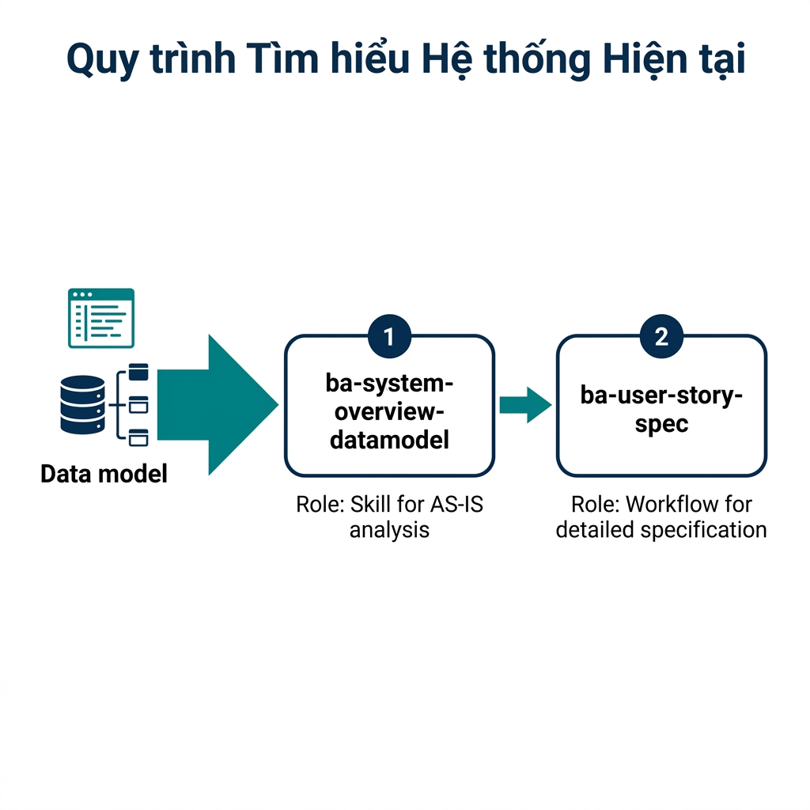

# Hướng Dẫn Quy Trình Tìm Hiểu Hệ Thống Hiện Tại

Quy trình Tìm hiểu Hệ thống Hiện tại giúp BA nhanh chóng nắm bắt cấu trúc, nghiệp vụ và các luồng xử lý của một hệ thống đã có sẵn (Brownfield project) thông qua việc phân tích mô hình dữ liệu (Data Model).

## 1. Mục tiêu của giai đoạn
- **Tài liệu hóa hệ thống cũ**: Chuyển đổi từ mã nguồn/cơ sở dữ liệu thô sang tài liệu đặc tả có cấu trúc.
- **Hiểu sâu về nghiệp vụ**: Thông qua bảng và các mối quan hệ dữ liệu để suy luận ra các quy tắc nghiệp vụ (Business Rules).
- **Nhận diện actors và ứng dụng**: Xác định ai là người dùng hệ thống và các ứng dụng thành phần tương tác với nhau như thế nào.
- **Xây dựng nền tảng cho thay đổi**: Tạo ra bộ tài liệu cơ sở để chuẩn bị cho các yêu cầu nâng cấp hoặc tích hợp sau này.

## 2. Quy trình thực hiện tuần tự

Để tìm hiểu một hệ thống hiện có, BA thực hiện theo 2 bước trọng tâm sau:

### Bước 1: Tổng quan hệ thống từ Data Model (`ba-system-overview-datamodel`)
- **Mục tiêu**: Xây dựng cái nhìn tổng thể về hệ thống (System Overview).
- **Hành động**: Sử dụng file **Data Model** (SQL/Schema) kết hợp với **Tên hệ thống, Mục đích, DS ứng dụng, DS đối tượng sử dụng** làm đầu vào. Skill này sẽ phân tích các bảng, trường dữ liệu để suy luận ra:
    - Danh sách các Ứng dụng/Module.
    - Các đối tượng người dùng (Actors).
    - Các quy trình nghiệp vụ cốt lõi.
- **Kết quả**: Tài liệu PRD System Overview giúp hiểu "Hệ thống này làm gì và dành cho ai".

### Bước 2: Đặc tả User Story cho hệ thống hiện có (`ba-user-story-spec`)
- **Mục tiêu**: Chi tiết hóa từng chức năng của hệ thống dưới dạng User Story.
- **Hành động**: Dựa trên kết quả tổng quan ở Bước 1, BA cung cấp thêm **Ảnh màn hình (MH)** của từng tính năng cần tổng hợp tài liệu. AI sẽ dựa vào hình ảnh và Data Model để đặc tả chính xác logic xử lý bên trong (Sequence, Rules).
- **Tham khảo**: Vui lòng xem hướng dẫn chi tiết tại: [Hướng Dẫn Đặc Tả & Triển Khai User Story](06-ba-hdsd-dac-ta-user-story.md).

## 3. Bảng tổng hợp các công cụ

| Tên | Loại | Mục đích | Đầu vào | Đầu ra mong muốn | Quy trình kế tiếp |
| :--- | :--- | :--- | :--- | :--- | :--- |
| `ba-system-overview-datamodel` | Skill | Tổng quan hệ thống AS-IS | Data Model (SQL/Schema), Tên HT, Mục đích, DS ứng dụng, DS đối tượng | Tài liệu System Overview PRD | `ba-user-story-spec` |
| `ba-user-story-spec` | **Workflow** | Đặc tả chi tiết chức năng | System Overview, Data Model, Ảnh MH từng US | Bộ hồ sơ User Story hoàn chỉnh | Quản lý/Nâng cấp hệ thống |

---
> [!TIP]
> Đây là quy trình cực kỳ hữu hiệu khi BA tiếp nhận dự án cũ không có tài liệu. Hãy bắt đầu từ việc trích xuất Schema cơ sở dữ liệu để AI có thể "đọc" được cấu trúc logic của toàn bộ hệ thống.
