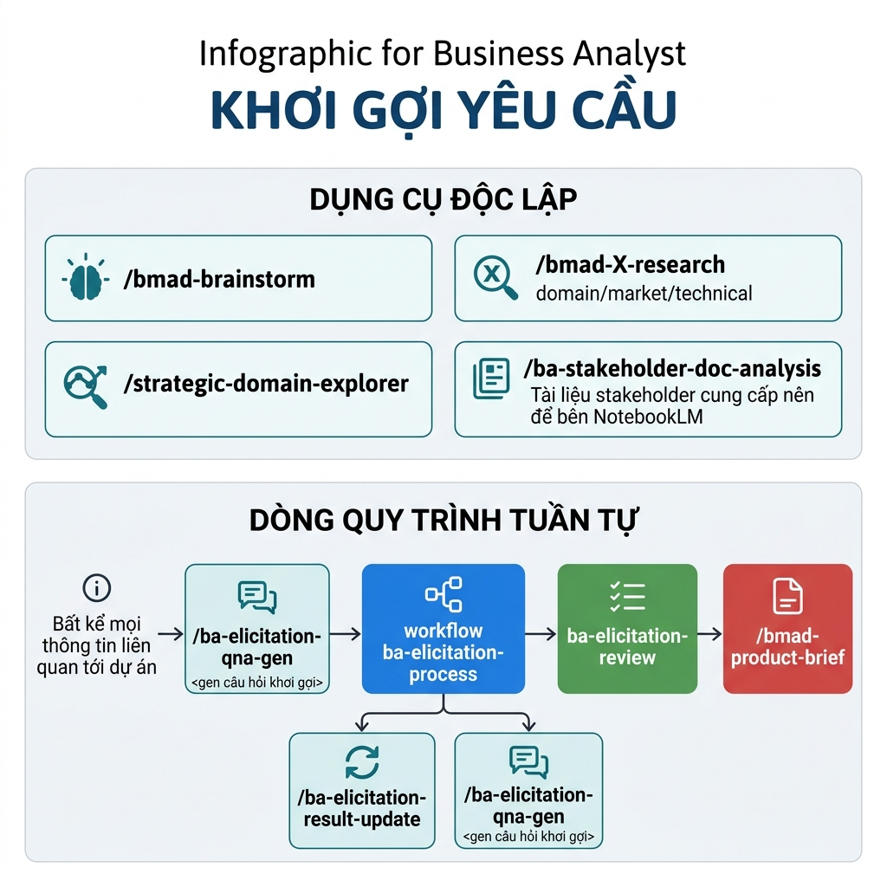

# Hướng Dẫn Giai Đoạn Khơi Gợi Yêu Cầu (Elicitation)

Giai đoạn Khơi gợi yêu cầu là bước khởi đầu quan trọng nhất để hiểu rõ nhu cầu của khách hàng, xác định phạm vi dự án và xây dựng nền tảng dữ liệu cho các giai đoạn tiếp theo.

## 1. Mục tiêu của giai đoạn
- **Thu thập đầy đủ thông tin**: Khai phá mọi ngóc ngách của nghiệp vụ, từ quy trình tổng quát đến các quy tắc chi tiết.
- **Xác định các thực thể (Entities)**: Nhận diện các đối tượng dữ liệu chính và mối quan hệ giữa chúng.
- **Làm rõ các điểm mù (Gaps)**: Phát hiện sớm các mâu thuẫn hoặc thiếu sót trong tài liệu khách hàng cung cấp.
- **Chuẩn bị đầu vào cho PRD**: Cung cấp dữ liệu thô nhưng đã được cấu trúc hóa để bắt đầu viết tài liệu Product Specification.

## 2. Cách tiếp cận và sử dụng Skill/Workflow

Hệ thống hỗ trợ BA theo hai cách tiếp cận linh hoạt: các **Skill độc lập** (có thể dùng bất cứ lúc nào) và các **Quy trình tuần tự** (kết nối chặt chẽ).

### 2.1. Các Skill độc lập (Independent Skills)
Đây là các công cụ hỗ trợ BA xử lý các tác vụ cụ thể, "rời rạc" tùy theo nhu cầu phát sinh tại từng thời điểm.

| Tên Skill | Mục tiêu | Khi nào cần sử dụng? |
| :--- | :--- | :--- |
| **`/bmad-brainstorm`** | Kích thích tư duy, tìm kiếm ý tưởng sáng tạo cho giải pháp. | Khi cần lên ý tưởng mới hoặc giải quyết các vấn đề nghiệp vụ chưa có lối thoát. |
| **`/bmad-X-research`** | Nghiên cứu sâu về Domain, Market hoặc Kỹ thuật. | Khi cần số liệu thị trường, tìm hiểu đối thủ hoặc khả năng khả thi về công nghệ. |
| **`strategic-domain-explorer`** | Phân tích bài bản 8 bước về một lĩnh vực (domain) mới. | Khi BA tiếp cận một lĩnh vực hoàn toàn mới và cần cái nhìn tổng thể từ mô hình kinh doanh đến E2E. |
| **`ba-stakeholder-doc-analysis`** | Trích xuất thông tin có cấu trúc từ tài liệu thô. | Khi nhận được file requirement, slide, hoặc meeting notes từ phía Stakeholder. (Hint: Nên sử dụng NotebookLM để xử lý tài liệu thô trước khi nạp vào AI). |

### 2.2. Quy trình thực hiện tuần tự (Sequential Flow)

Để đảm bảo hiệu quả tối đa, BA nên thực hiện theo luồng tuần tự như sơ đồ trên để kết nối các kết quả trung gian. **Đáng chú ý, các kết quả đầu ra từ các Skill độc lập ở mục 2.1 có thể được linh hoạt đưa vào làm đầu vào cho các Skill hoặc Workflow trong quy trình này. Bạn hãy tự cân nhắc tính phù hợp và cần thiết của thông tin dự án để quyết định dữ liệu nạp vào.**

1.  **`ba-elicitation-qna-gen`**: 
    - *Mục tiêu*: Dựa trên thông tin sơ bộ hoặc tài liệu phân tích được, AI sẽ sinh ra bộ câu hỏi phỏng vấn chuyên sâu (bao gồm cả NFR).
    - *Dùng khi*: Chuẩn bị cho buổi họp phỏng vấn (Interview), workshop với stakeholder, hoặc khi chính BA/AI cần xác định **checklist các thông tin còn thiếu** cần phải tự làm rõ để hoàn thiện hồ sơ dự án.
2.  **`ba-elicitation-process` (Workflow)**:
    - *Mục tiêu*: Cập nhật và tinh lọc kết quả khơi gợi yêu cầu sau khi BA đã làm rõ thông tin với Stakeholder.
    - *Dùng khi*: Khi có thông tin mới từ Stakeholder cần được nạp vào hệ thống để cập nhật danh sách tracking và tóm tắt yêu cầu chính thức.
    - *Lưu ý*: Workflow này là sự kết hợp khép kín giữa 2 Skill chính:
        - **`ba-elicitation-result-update`**: Dùng để cập nhật trực tiếp các nội dung đã làm rõ (từ Meeting Notes, Stakeholder Files hoặc nội dung người dùng chat trực tiếp) vào tài liệu tổng hợp yêu cầu.
        - **`ba-elicitation-qna-gen`**: Dùng để tiếp tục soi xét các kẽ hở thông tin sau khi cập nhật, từ đó sinh tiếp các câu hỏi làm rõ mới (vòng lặp cho đến khi hết Gap).
3.  **`ba-elicitation-review`**:
    - *Mục tiêu*: Chấm điểm và đánh giá chất lượng kết quả khơi gợi dựa trên 8 tiêu chí chuyên sâu (thực thể, trạng thái, gap...).
    - *Dùng khi*: Muốn kiểm tra xem thông tin đã đủ để chuyển sang giai đoạn thiết kế/đặc tả hay chưa.
4.  **`/bmad-product-brief`**:
    - *Mục tiêu*: Đóng gói toàn bộ kết quả đã khơi gợi và review thành một bản tóm tắt sản phẩm (Product Brief) súc tích.
    - *Dùng khi*: Kết thúc giai đoạn khơi gợi, cần chốt lại tầm nhìn và yêu cầu cốt lõi với stakeholder.

## 3. Bảng tổng hợp các công cụ liên quan

| Tên | Loại | Mục đích chính | Đầu vào | Đầu ra mong muốn |
| :--- | :--- | :--- | :--- | :--- |
| `ba-elicitation-process` | **Workflow** | Quản lý quy trình khơi gợi khép kín | Chat, tài liệu stakeholder, ghi chú họp | Updated Tracking (kèm Q&A), Req. Summary, Elicitation History |
| `ba-elicitation-qna-gen` | Skill | Tạo câu hỏi khơi gợi thông minh | Các thông tin liên quan tới yêu cầu đã có | Danh sách câu hỏi (MD/Docx) |
| `ba-elicitation-result-update` | Skill | Cập nhật kết quả khơi gợi vào tài liệu dự án | Meeting notes, files, chat | Updated Tracking List, Requirement Summary, Elicitation History (lịch sử qua các lần) |
| `ba-elicitation-review` | Skill | Review chất lượng khơi gợi (8 tiêu chí) | Tài liệu Requirement Summary | Báo cáo đánh giá & QA Follow-up |
| `ba-stakeholder-doc-analysis` | Skill | Phân tích tài liệu từ khách hàng | PDF, Docx, Hình ảnh yêu cầu | Phân tích Entity, E2E Flow, Stakeholder |
| `strategic-domain-explorer` | Skill | Khám phá Domain theo 8 bước | Tên Domain/Ngành | Business Model, ERD High-level, E2E |
| `/bmad-product-brief` | Skill | Tổng hợp thành Product Brief | Yêu cầu đã được review | Tài liệu Product Brief |
| `/bmad-brainstorm` | Skill | Động não giải pháp | Nhu cầu, Thử thách | Ý tưởng, Giải pháp đột phá |
| `/bmad-X-research` | Skill | Nghiên cứu Domain/Market/Tech | Keyword/Topic nghiên cứu | Báo cáo nghiên cứu chi tiết |
