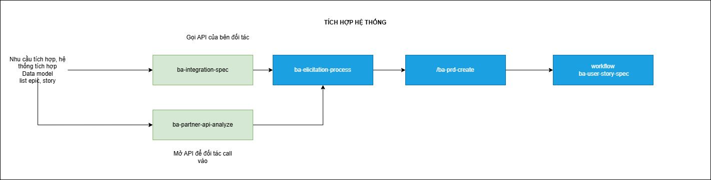

# Hướng Dẫn Quy Trình Tích Hợp Hệ Thống

Quy trình Tích hợp Hệ thống giúp BA xác định các điểm chạm kỹ thuật giữa hệ thống nội bộ và các đối tác bên ngoài, từ đó đảm bảo luồng dữ liệu được thông suốt và bảo mật.

## 1. Mục tiêu của giai đoạn
- **Xác định phương thức tích hợp**: Lựa chọn giữa việc gọi API đối tác hay mở API cho đối tác gọi vào.
- **Làm rõ các điểm chạm kỹ thuật**: Xác định các endpoint, phương thức xác thực (Auth), cấu trúc dữ liệu mapping và các mã lỗi.
- **Đảm bảo tính sẵn sàng của dữ liệu**: Đảm bảo Data Model nội bộ tương thích với dữ liệu từ đối tác.
- **Hợp nhất vào tài liệu PRD**: Đưa các yêu cầu tích hợp vào hồ sơ sản phẩm để đội ngũ kỹ thuật triển khai.

## 2. Quy trình thực hiện tuần tự

Tùy thuộc vào nhu cầu tích hợp là **chủ động gọi** hay **bị động nhận** dữ liệu, BA sẽ bắt đầu với các Skill tương ứng:

### Bước 1: Phân tích giải pháp tích hợp
Dựa vào bài toán thực tế, BA chọn một trong hai hướng:
- **Hướng 1: Hệ thống mình gọi API đối tác**: Sử dụng skill **`ba-integration-spec`**. Skill này tập trung vào việc đọc tài liệu API của đối tác và đề xuất luồng tích hợp logic. Bạn nên cung cấp thêm danh sách **Epics và User Stories** của dự án để AI nắm rõ ngữ cảnh và xác định chính xác các Use Case bị ảnh hưởng.
- **Hướng 2: Mở API để đối tác gọi vào**: Sử dụng skill **`ba-partner-api-analyze`**. Skill này giúp thiết kế các endpoint mà đối tác cần để tương tác với hệ thống của mình.

### Bước 2: Khơi gợi và Chốt yêu cầu tích hợp (ba-elicitation-process)
- **Mục tiêu**: Làm rõ các tham số, tần suất gọi, cơ chế đối soát hoặc các trường hợp lỗi phát sinh.
- **Hành động**: Sử dụng kết quả phân tích ở Bước 1 để thực hiện khơi gợi và chốt phương án cuối cùng với Stakeholder/Kỹ thuật đối tác.
- **Kết quả**: Tài liệu phân tích tích hợp hoàn chỉnh.

### Bước 3: Cập nhật tài liệu PRD (/ba-prd-create)
- **Mục tiêu**: Hợp nhất các module tích hợp vào PRD tổng thể.
- **Hành động**: Chạy workflow `/ba-prd-create` để bổ sung phần "System Integration" vào tài liệu PRD.
- **Kết quả**: Tài liệu PRD có chứa các luồng tích hợp chi tiết.

### Bước 4: Thiết kế và Đặc tả User Story (ba-user-story-spec)
Sau khi có khung tích hợp trong PRD, BA thực hiện đặc tả chi tiết cho các User Story liên quan đến tính năng tích hợp.
Vui lòng tham khảo hướng dẫn thực hiện chi tiết tại đây: [Hướng Dẫn Đặc Tả & Triển Khai User Story](06-ba-hdsd-dac-ta-user-story.md).

## 3. Bảng tổng hợp các công cụ

| Tên | Loại | Mục đích | Đầu vào | Đầu ra mong muốn | Quy trình kế tiếp |
| :--- | :--- | :--- | :--- | :--- | :--- |
| `ba-integration-spec` | Skill | Phân tích gọi API đối tác | API Doc đối tác, Data Model, List Epics & US | Luồng tích hợp E2E | `ba-elicitation-process` |
| `ba-partner-api-analyze` | Skill | Thiết kế API cho đối tác gọi | Nhu cầu tích hợp | Danh sách API cần mở | `ba-elicitation-process` |
| `ba-elicitation-process` | **Workflow** | Chốt phương án tích hợp | Phân tích tích hợp thô | Hồ sơ tích hợp hoàn chỉnh | `/ba-prd-create` |
| `/ba-prd-create` | **Workflow** | Cập nhật PRD tích hợp | Hồ sơ tích hợp | Tài liệu PRD (Updated) | `ba-user-story-spec` |
| `ba-user-story-spec` | **Workflow** | Đặc tả US tích hợp | Tên US, Ảnh màn hình, Data Model | Hồ sơ US Spec cho tích hợp | Tham khảo [HDSD Đặc tả US](06-ba-hdsd-dac-ta-user-story.md) |

---
> [!IMPORTANT]
> Tích hợp hệ thống thường chứa nhiều rủi ro về mặt an ninh và hiệu năng. Luôn yêu cầu tài liệu Sandbox hoặc tài liệu kỹ thuật mới nhất từ đối tác trước khi bắt đầu bước phân tích.
