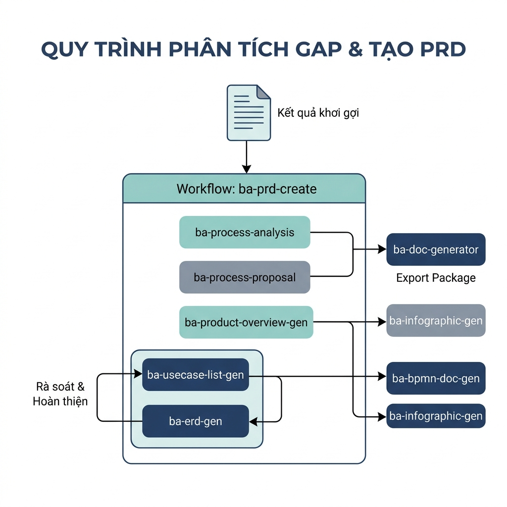
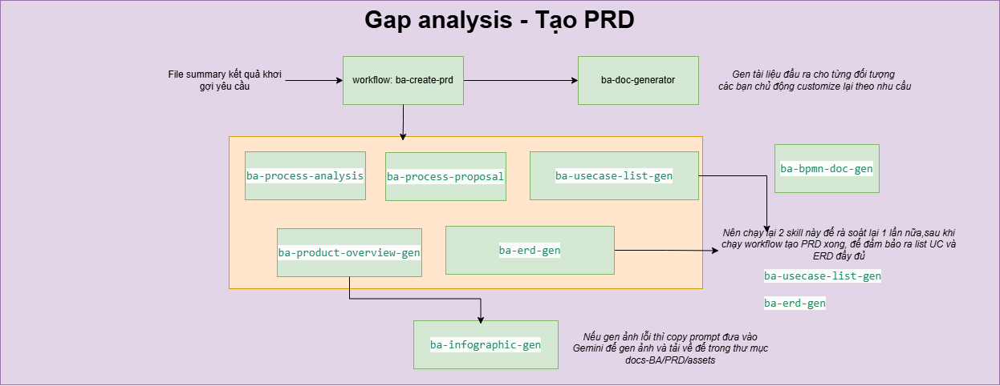

# Hướng Dẫn Giai Đoạn Phân Tích Gap & Tạo PRD

Giai đoạn này tập trung vào việc chuyển đổi kết quả khơi gợi yêu cầu thành tài liệu đặc tả PRD chi tiết, giúp xác định lộ trình phát triển giải pháp.

## 1. Mục tiêu của giai đoạn
- **Xây dựng PRD**: Chuyển từ hiện trạng (AS-IS) sang đề xuất (TO-BE).
- **Chi tiết hóa nghiệp vụ**: Phân tích quy trình, Use Case và mô hình dữ liệu.
- **Trực quan hóa & Đóng gói**: Tạo biểu đồ, infographic và xuất bản tài liệu cho các bên liên quan.

## 2. Cách tiếp cận và sử dụng Skill/Workflow

### Chú giải sơ đồ:
| Thành phần | Ý nghĩa | Công cụ/Skill hỗ trợ |
| :--- | :--- | :--- |
| **Input (Kết quả khơi gợi)** | File tóm tắt mọi yêu cầu thu thập được từ stakeholder. | `ba-elicitation-result-update` |
| **ba-prd-create** | Workflow trung tâm điều phối việc tạo tài liệu PRD. | `/ba-prd-create` |
| **Analysis & Proposal** | Phân tích hiện trạng (AS-IS) và đề xuất giải pháp (TO-BE). | `ba-process-analysis`, `ba-process-proposal` |
| **System Design** | Thiết kế tổng quan sản phẩm, Use Case và mô hình dữ liệu. | `ba-product-overview-gen`, `ba-usecase-list-gen`, `ba-erd-gen` |
| **BPMN & Infographic** | Trực quan hóa quy trình và mô hình tổng quan. | `ba-bpmn-doc-gen`, `ba-infographic-gen` |
| **Documentation** | Xuất bản tài liệu PRD hoàn chỉnh cho từng đối tượng. | `ba-doc-generator` |
| **Rà soát & Hoàn thiện** | Chạy kiểm tra lại Use Case và ERD để đảm bảo chất lượng. | `ba-usecase-list-gen`, `ba-erd-gen` |

---

Theo sơ đồ quy trình, các công cụ được chia thành các Skill độc lập (có thể dùng rà soát) và luồng Workflow trung tâm.

### 2.1. Các Skill độc lập và bổ trợ (Independent Skills)
Đây là các Skill xuất hiện bên ngoài luồng chính hoặc được dùng để rà soát, hoàn thiện tài liệu.

| Tên Skill | Mục tiêu | Khi nào cần sử dụng? |
| :--- | :--- | :--- |
| **`ba-doc-generator`** | Gen tài liệu đầu ra chuyên nghiệp cho từng đối tượng. | Sau khi có nội dung PRD, dùng để xuất bản và chủ động customize theo nhu cầu. |
| **`ba-bpmn-doc-gen`** | Vẽ sơ đồ quy trình nghiệp vụ chuẩn BPMN. | Sử dụng sau khi đã có danh sách Use Case hoặc quy trình đề xuất để trực quan hóa luồng nghiệp vụ. |
| **`ba-infographic-gen`** | Tạo ảnh infographic minh họa. | Sử dụng để trực quan hóa bản tóm tắt sản phẩm (Product Overview). *Lưu ý: Nếu lỗi, copy prompt vào Gemini để gen ảnh.* |
| **`ba-usecase-list-gen`** | Phân tích và rà soát danh sách Use Case. | **Nên chạy lại lần nữa** sau khi hoàn thành Workflow PRD để đảm bảo danh sách Use Case đầy đủ và chính xác. |
| **`ba-erd-gen`** | Phân tích và rà soát mô hình dữ liệu (ERD). | **Nên chạy lại lần nữa** sau khi hoàn thành Workflow PRD để kiểm tra tính toàn vẹn của dữ liệu. |

### 2.2. Quy trình thực hiện tuần tự (Sequential Flow)

Luồng thực hiện chính xoay quanh Workflow PRD và các Skill thành phần bên trong.

1.  **`/ba-prd-create` (Workflow)**: 
    - *Mục tiêu*: Tiếp nhận file Summary khơi gợi yêu cầu để tạo PRD tổng thể.
    - *Đầu vào*: File summary kết quả khơi gợi yêu cầu.

    

2.  **Các thành phần trong Workflow (Orange Box)**:
    Khi chạy Workflow PRD, các Skill sau sẽ được phối hợp thực hiện để xây dựng nội dung:
    - **`ba-process-analysis`**: Phân tích quy trình hiện tại (AS-IS).
    - **`ba-process-proposal`**: Thiết kế quy trình đề xuất (TO-BE).
    - **`ba-product-overview-gen`**: Xây dựng mô hình tổng quan sản phẩm.
    - **`ba-usecase-list-gen`** & **`ba-erd-gen`**: Thiết kế khung chức năng và dữ liệu thô.

## 3. Bảng tổng hợp các công cụ (Theo sơ đồ)

| Tên | Loại | Mục đích chính | Đầu vào | Đầu ra mong muốn |
| :--- | :--- | :--- | :--- | :--- |
| `ba-prd-create` | **Workflow** | Tạo PRD hoàn chỉnh | File Summary Khơi gợi | Tài liệu PRD tổng thể |
| `ba-process-analysis` | Skill | Phân tích quy trình AS-IS | Kết quả khơi gợi | Tài liệu phân tích AS-IS |
| `ba-process-proposal` | Skill | Thiết kế giải pháp TO-BE | Phân tích AS-IS | Mô tả quy trình đề xuất |
| `ba-product-overview-gen`| Skill | Xây dựng tổng quan sản phẩm | PRD/Requirement | Mô hình App flows, Actors |
| `ba-usecase-list-gen` | Skill | Phân tích danh sách Use Case | Summary khơi gợi, Quy trình đề xuất, hoặc Chat trực tiếp thông tin đã có | Master Use Case List |
| `ba-erd-gen` | Skill | Thiết kế mô hình dữ liệu (ERD) | Summary khơi gợi, Quy trình đề xuất | ERD Mermaid, Data Dictionary |
| `ba-bpmn-doc-gen` | Skill | Vẽ quy trình nghiệp vụ BPMN | File mô tả các bước của quy trình (Ví dụ: as-is, to-be) | BPMN Diagram |
| `ba-doc-generator` | Skill | Xuất tài liệu theo đối tượng | Nội dung PRD | Tài liệu PRD hoàn chỉnh (Docx/MD) |
| `ba-infographic-gen` | Skill | Trực quan hóa mô hình | Text mô tả | Ảnh Infographic |
