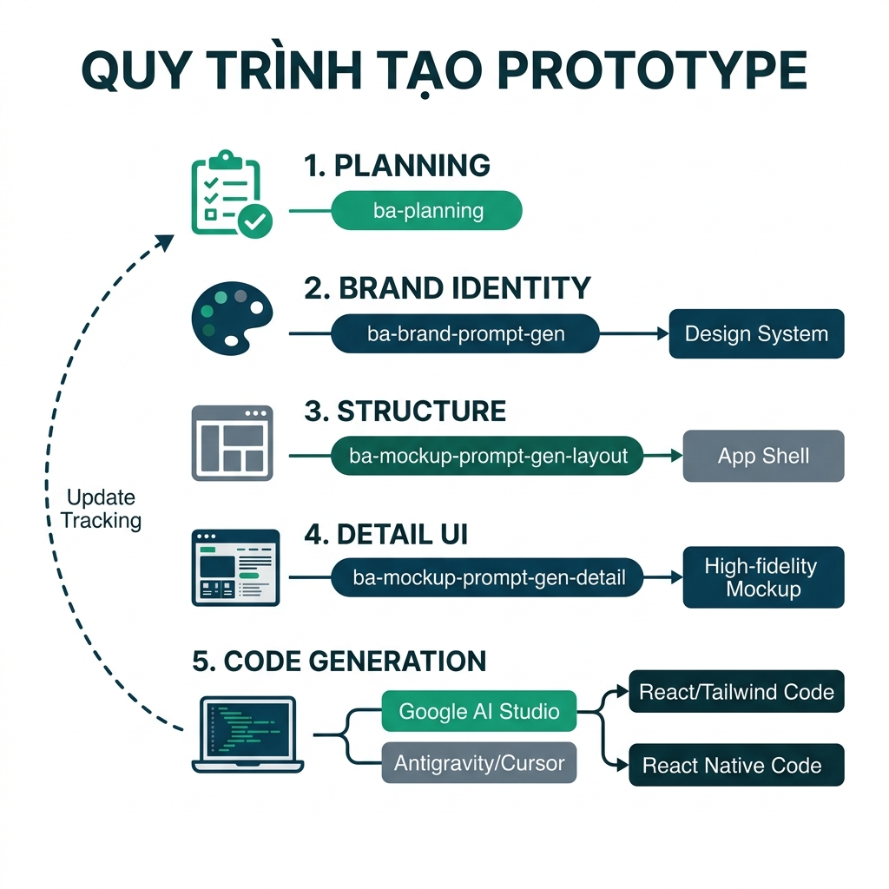

# Hướng Dẫn Giai Đoạn Tạo Prototype (UI/UX & Frontend Code)

Giai đoạn Tạo Prototype giúp hiện thực hóa các yêu cầu nghiệp vụ (User Stories) thành giao diện trực quan (Mockup) và mã nguồn Frontend (Code), giúp các Stakeholder có cái nhìn sống động về sản phẩm trước khi đi vào phát triển chính thức.

## 1. Mục tiêu của giai đoạn
- **Trực quan hóa nghiệp vụ**: Giúp Stakeholder xác nhận luồng đi và bố cục thông tin trên màn hình.
- **Xây dựng Design System**: Đảm bảo tính nhất quán về màu sắc, typography và components trên toàn bộ ứng dụng.
- **Rút ngắn thời gian phát triển**: Sinh mã nguồn Frontend (React/Tailwind) từ các bản thiết kế mockup chất lượng cao.
- **Đảm bảo tính khả thi**: Kiểm chứng giao diện với dữ liệu thực tế (Data Model).

## 2. Chi tiết các bước thực hiện

### Chú giải sơ đồ:
| Thành phần | Ý nghĩa | Công cụ/Skill hỗ trợ |
| :--- | :--- | :--- |
| **Epic/US List** | Đầu vào là danh sách các yêu cầu nghiệp vụ đã được đặc tả. | `ba-user-story-spec` |
| **Planning** | Khởi tạo và theo dõi tiến độ từng màn hình. | `ba-planning` |
| **Brand Identity** | Xác định phong cách thiết kế, màu sắc (Tokens). | `ba-brand-prompt-gen` |
| **Structure** | Thiết kế bộ khung điều hướng (Navigation Shell). | `ba-mockup-prompt-gen_layout` |
| **Detail UI** | Thiết kế chi tiết logic nghiệp vụ trên từng màn hình. | `ba-mockup-prompt-gen_detail` |
| **Prototype** | Chuyển đổi từ thiết kế sang bản chạy thử (AI Studio). | Google AI Studio |
| **Update Tracking** | Cập nhật trạng thái "Done" cho các hạng mục đã hoàn thành. | `ba-planning` |

---

### Bước 1: Quản lý lộ trình (ba-planning)
- **Mục tiêu**: Đảm bảo mọi User Story đều được theo dõi tiến độ thiết kế.
- **Hành động**: Gọi skill `ba-planning` để khởi tạo hoặc cập nhật file `ba-development-tracking.md`.
- **Kết quả**: Danh sách các màn hình cần thiết kế được định diện rõ ràng.

### Bước 2: Thiết lập bản sắc thương hiệu (ba-brand-prompt-gen)
- **Mục tiêu**: Tạo ra bộ "linh hồn" cho thiết kế (Tokens, Colors, Typography).
- **Hành động**: Sử dụng `ba-brand-prompt-gen`. Bạn nên cung cấp 1 **ảnh thiết kế mẫu** mà khách hàng yêu thích để AI phân tích phong cách.
- **Sử dụng Tool**: Copy Prompt thu được dán vào **Stitch** (hoặc v0/Figma Make) để sinh Design System.

### Bước 3: Thiết kế khung sườn - App Shell (ba-mockup-prompt-gen_layout)
- **Mục tiêu**: Tạo ra bộ khung điều hướng (Navigation, Sidebar, Header).
- **Hành động**: Sử dụng `ba-mockup-prompt-gen_layout`. Skill này tập trung vào cấu trúc tổng thể thay vì chi tiết nghiệp vụ bên trong.
- **Sử dụng Tool**: Dán Prompt vào **Stitch** để có bản layout chuẩn.

### Bước 4: Thiết kế chi tiết màn hình (ba-mockup-prompt-gen_detail)
- **Mục tiêu**: Thiết kế nội dung chi tiết theo từng User Story và Data Model.
- **Hành động**: Sử dụng `ba-mockup-prompt-gen_detail`. 
    - *Mẹo*: Hãy yêu cầu gen từ 5-10 màn hình có liên quan trong cùng một luồng để đảm bảo tính logic.
- **Sử dụng Tool**: Dán Prompt vào **Stitch** để hoàn thiện các bản Mockup High-fidelity.

### Bước 5: Sinh mã nguồn và Prototype (AI Studio)
- **Mục tiêu**: Chuyển từ ảnh/Thiết kế sang Code có thể chạy được.
- **Hành động**: Chụp ảnh hoặc lấy link thiết kế từ Stitch, đẩy vào **Google AI Studio** kèm theo các yêu cầu về Tech Stack (React, Tailwind, v.v.).
- **Lưu ý**: Sau khi có code, hãy quay lại `ba-planning` để cập nhật trạng thái đã hoàn thành (Done) cho các đầu mục công việc.

## 3. Bảng tổng hợp các công cụ

| Tên | Loại | Mục đích | Đầu vào | Đầu ra mong muốn | Quy trình kế tiếp |
| :--- | :--- | :--- | :--- | :--- | :--- |
| `ba-planning` | Skill | Tracking tiến độ | List User Story | `ba-development-tracking.md` (Updated) | `ba-brand-prompt-gen` |
| `ba-brand-prompt-gen` | Skill | Gen prompt Design System | Ảnh mẫu, Brand Info | Prompt Design System (Stitch/v0) | Stitch Design |
| `ba-mockup-prompt-gen_layout` | Skill | Gen prompt App Shell | Design System | Prompt App Shell | Stitch Layout |
| `ba-mockup-prompt-gen_detail` | Skill | Gen prompt màn hình chi tiết | Data Model, Tên US | Prompt thiết kế chi tiết | Stitch Detailed Design |
| `ba-ui-layout-gen` | Skill | Tạo Layout HTML nhanh | Brand Guideline | Layout HTML Prototype | Xem xét UI nhanh |

---
> [!TIP]
> Luôn giữ cho file `ba-development-tracking.md` được cập nhật sau mỗi bước để Agent có được context chính xác nhất về những gì đã làm và những gì còn sót lại.
