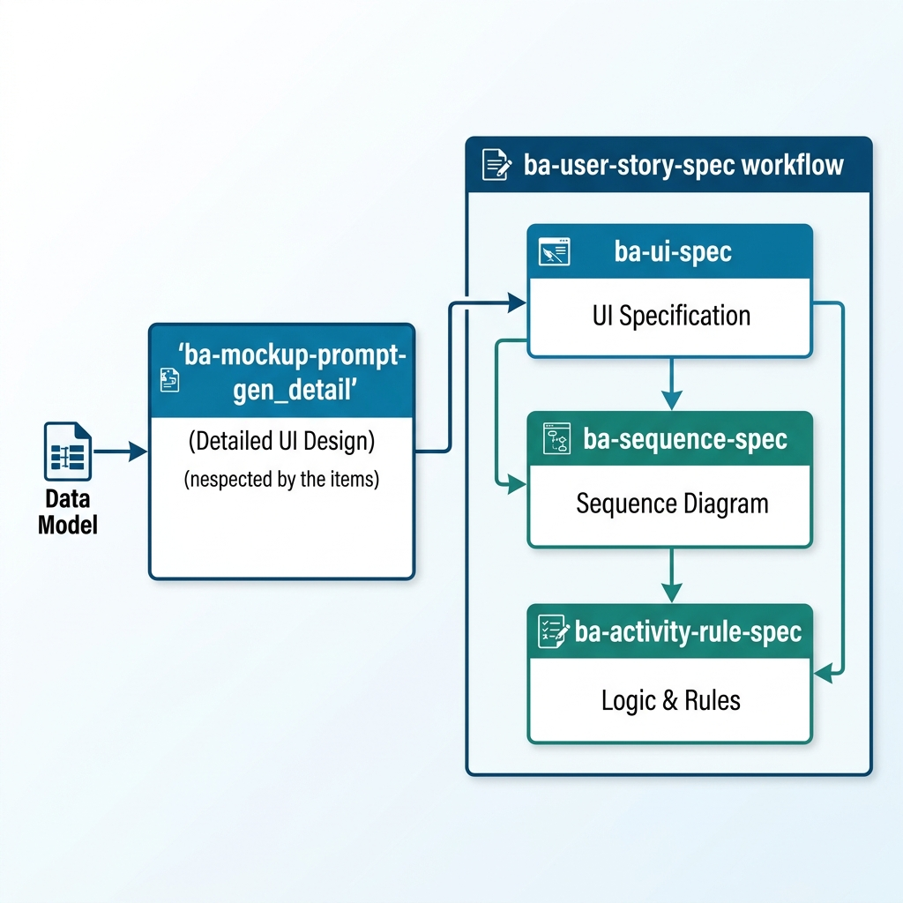

# Hướng Dẫn Giai Đoạn Đặc Tả & Triển Khai User Story

Giai đoạn này tập trung vào việc chi tiết hóa các yêu cầu người dùng (User Story) thành các tài liệu kỹ thuật nghiệp vụ chuyên sâu, sẵn sàng cho việc phát triển (Backend/API) và kiểm thử (QA).

## 1. Mục tiêu của giai đoạn
- **Chi tiết hóa giao diện**: Xác định rõ các controls, quy định nhập liệu và logic hiển thị trên từng màn hình.
- **Minh bạch hóa luồng xử lý**: Mô tả trình tự tương tác giữa người dùng, hệ thống và các đối tác bên thứ ba thông qua Sequence Diagram.
- **Chốt quy tắc nghiệp vụ**: Định nghĩa các quy tắc kiểm tra (Validation Rules) và các hành động cần thực hiện (Actions/API) cho từng User Story.
- **Sẵn sàng cho việc thực thi**: Cung cấp bộ hồ sơ đặc tả đầy đủ để lập trình viên bắt tay vào code.

## 2. Quy trình đặc tả chi tiết (ba-user-story-spec)

Quy trình này thường được thực hiện thông qua Workflow **`ba-user-story-spec`** nhằm kết nối 4 bước quan trọng sau đây một cách liền mạch:

| Thành phần | Ý nghĩa / Chức năng |
| :--- | :--- |
| **Data Model** | Đầu vào chính, cung cấp cấu trúc dữ liệu để thiết kế màn hình. |
| **ba-mockup-prompt-gen_detail** | Tạo ra các bản thiết kế UI chi tiết cho từng Story. |
| **ba-ui-spec** | Đặc tả chi tiết các control và quy tắc hiển thị trên giao diện. |
| **ba-sequence-spec** | Mô tả luồng tương tác giữa User, Frontend và Backend via API. |
| **ba-activity-rule-spec** | Đặc tả các quy tắc Validate và Logic xử lý dữ liệu tại Backend. |

### Bước 1: Thiết kế chi tiết màn hình (ba-mockup-prompt-gen_detail)
- **Mục tiêu**: Có được bản thiết kế UI chi tiết làm cơ sở để đặc tả.
- **Nội dung**: Sử dụng kết quả từ giai đoạn "Tạo Prototype" hoặc chạy lại skill này với dữ liệu từ **Data Model** để hoàn thiện các màn hình chi tiết của từng User Story.
- **Lưu ý**: Đây là bước "visualize" lại nghiệp vụ trước khi đi vào mô tả chi tiết bằng văn bản.

### Bước 2: Đặc tả chi tiết giao diện (ba-ui-spec)
- **Mục tiêu**: Mô tả cách thức hoạt động của từng thành phần trên màn hình (UI Specification).
- **Nội dung**: Skill này sẽ phân tích màn hình và tạo bảng đặc tả các control (Input, Button, Dropdown...), các trạng thái hiển thị và quy định nhập liệu cơ bản.
- **Kết quả**: Tài liệu UI Spec cho từng màn hình.

### Bước 3: Đặc tả luồng tương tác (ba-sequence-spec)
- **Mục tiêu**: Làm rõ luồng dữ liệu giữa User - Frontend - Backend.
- **Nội dung**: Sinh các sơ đồ Sequence (Mermaid) minh họa trình tự gọi API và xử lý dữ liệu. Nếu có tích hợp bên thứ ba (Partner), luồng này sẽ chỉ rõ các điểm chạm tích hợp.
- **Kết quả**: Sơ đồ Sequence và danh sách các API cần phát triển.

### Bước 4: Đặc tả quy chế xử lý và hành động (ba-activity-rule-spec)
- **Mục tiêu**: "Luật hóa" các nghiệp vụ phức tạp.
- **Nội dung**: Đặc tả chi tiết các Rule Validate (Điều kiện để thực hiện hành động) và các kết quả mong đợi của mỗi hành động (Logic xử lý tại Backend).
- **Kết quả**: Bảng Logic Mapping và Rule Specification hoàn chỉnh cho User Story.

## 3. Bảng tổng hợp các công cụ

| Tên | Loại | Mục đích | Đầu vào | Đầu ra mong muốn | Quy trình kế tiếp |
| :--- | :--- | :--- | :--- | :--- | :--- |
| `ba-user-story-spec` | **Workflow** | Chạy toàn bộ quy trình đặc tả | Tên US, Ảnh màn hình, Data Model | Hồ sơ US Spec hoàn chỉnh | Hoàn thiện hồ sơ US |
| `ba-mockup-prompt-gen_detail` | Skill | Thiết kế màn hình chi tiết | Data Model | Prompt thiết kế chi tiết | `ba-ui-spec` |
| `ba-ui-spec` | Skill | Viết đặc tả control/màn hình | Ảnh màn hình/Mockup | Tài liệu UI Specification | `ba-sequence-spec` |
| `ba-sequence-spec` | Skill | Vẽ Sequence và xác định API | Ảnh MH, UI Spec, Luồng nghiệp vụ, User Flow | Sơ đồ Sequence & Danh sách API | `ba-activity-rule-spec` |
| `ba-activity-rule-spec` | Skill | Đặc tả Rule và Logic xử lý | Sequence Spec, Data Model | Bảng Logic Mapping & Rule Spec | Dev/Implement Code |

---
> [!IMPORTANT]
> Việc thực hiện đầy đủ 4 bước trên giúp giảm thiểu tối đa các sai sót logic và "re-work" (làm lại) trong giai đoạn code Backend. Hãy đảm bảo Data Model đã được thống nhất trước khi chạy Workflow này.
