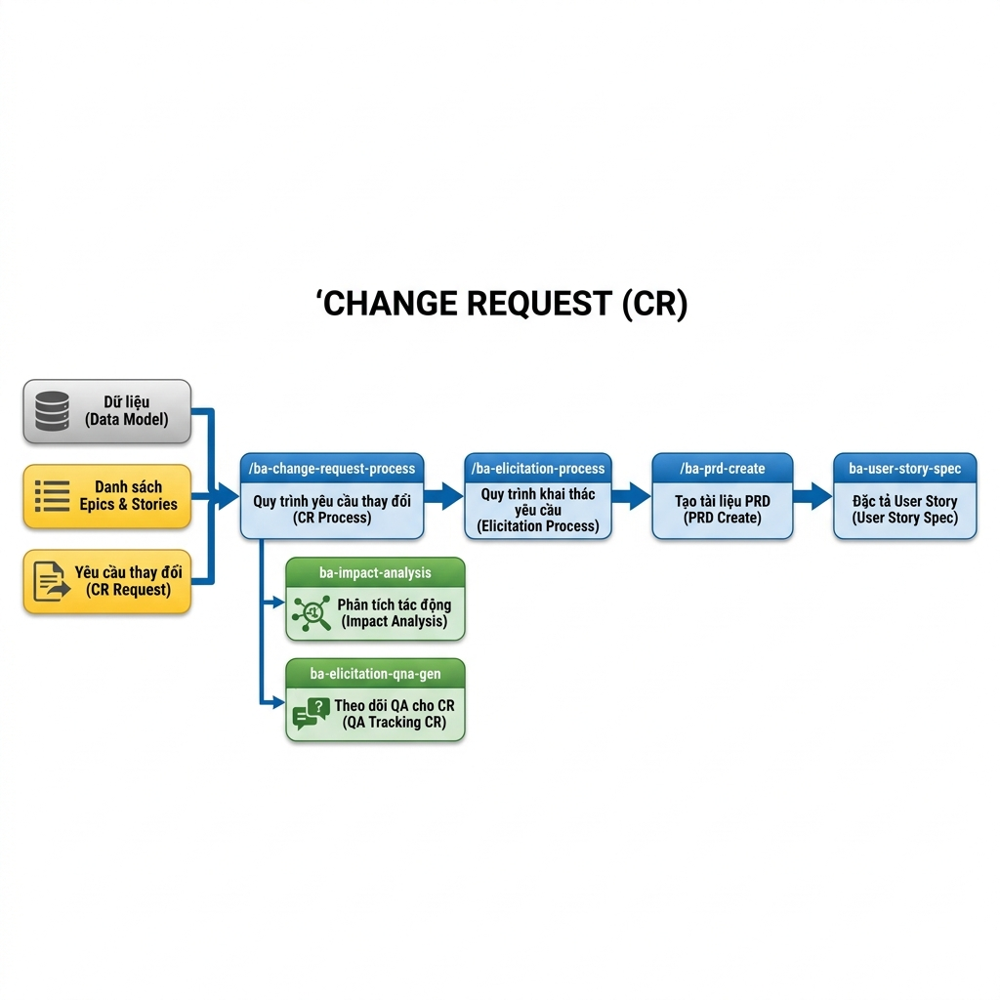

# Hướng Dẫn Quy Trình Xử Lý Thay Đổi (Change Request)

Quy trình Xử lý Thay đổi (CR) giúp kiểm soát các yêu cầu phát sinh sau khi dự án đã có bộ tài liệu cơ sở (Baseline), đảm bảo mọi thay đổi đều được phân tích ảnh hưởng và cập nhật đồng bộ vào hệ thống tài liệu.

## 1. Mục tiêu của giai đoạn
- **Phân tích tác động**: Xác định rõ mức độ ảnh hưởng của yêu cầu thay đổi tới Data Model, PRD và các User Story hiện tại.
- **Duy trì tính nhất quán**: Đảm bảo PRD và các tài liệu đặc tả luôn phản ánh đúng trạng thái mới nhất của sản phẩm.
- **Quản lý rủi ro**: Phát hiện sớm các mâu thuẫn giữa yêu cầu mới và các tính năng đã phát triển.
- **Traceability**: Theo vết được lịch sử thay đổi từ yêu cầu ban đầu của khách hàng đến thiết kế và code thực tế.

## 2. Quy trình thực hiện tuần tự

Quy trình CR được thiết kế dưới dạng chuỗi các Workflow nối tiếp nhau để đảm bảo không bỏ sót bất kỳ tác động nào:

### Bước 1: Tiếp nhận và Phân tích ảnh hưởng (/ba-change-request-process)
- **Đầu vào**: Yêu cầu thay đổi, Data Model, List Epic & User Story.
- **Hành động**: Chạy workflow `/ba-change-request-process`.
- **Thành phần chính**:
    - **`ba-impact-analysis`**: Tự động liệt kê các màn hình, API và bảng dữ liệu bị ảnh hưởng.
    - **`ba-elicitation-qna-gen`**: Sinh bộ câu hỏi làm rõ để BA xác nhận lại với khách hàng về phạm vi thay đổi (QA Tracking CR).

### Bước 2: Khơi gợi và Chốt yêu cầu mới (/ba-elicitation-process)
- **Mục tiêu**: Làm rõ các điểm còn mơ hồ và cập nhật lại hồ sơ phân tích ảnh hưởng.
- **Hành động**: Sử dụng kết quả trả lời các câu hỏi làm rõ (từ Bước 1) và file Impact Analysis hiện tại để chạy workflow này.
- **Kết quả**: File Impact Analysis được cập nhật đầy đủ và chính xác các thay đổi cuối cùng.

### Bước 3: Cập nhật tài liệu PRD (/ba-prd-create)
- **Mục tiêu**: Hợp nhất các yêu cầu thay đổi đã chốt vào hồ sơ Product Requirements Document.
- **Hành động**: Sử dụng file **Impact Analysis (đã được làm rõ ở Bước 2)** làm đầu vào chính để chạy workflow này. 
- **Kết quả**: Tài liệu PRD hoàn chỉnh. AI sẽ tự động cập nhật nội dung mới vào file PRD hiện có (nếu liên quan) hoặc khởi tạo một file PRD mới (nếu nội dung thay đổi tạo ra một module/sản phẩm mới).

### Bước 4: Thiết kế và Đặc tả chi tiết cho User Story
Sau khi có bản PRD cập nhật, BA thực hiện đặc tả chi tiết cho các User Story liên quan. 
Vui lòng tham khảo hướng dẫn thực hiện chi tiết tại đây: [Hướng Dẫn Đặc Tả & Triển Khai User Story](06-ba-hdsd-dac-ta-user-story.md).

## 3. Bảng tổng hợp các công cụ

| Tên | Loại | Mục đích | Đầu vào | Đầu ra mong muốn | Quy trình kế tiếp |
| :--- | :--- | :--- | :--- | :--- | :--- |
| `/ba-change-request-process` | **Workflow** | Phân tích Impact & Tracking | Yêu cầu thay đổi, Data Model, List Epic & User Story | File phân tích CR, Q&A (Làm rõ yêu cầu) | `/ba-elicitation-process` |
| `ba-impact-analysis` | Skill | Liệt kê phạm vi ảnh hưởng | Thay đổi nghiệp vụ | Báo cáo Impact Analysis | `ba-prd-create` |
| `/ba-elicitation-process` | **Workflow** | Làm rõ yêu cầu thay đổi | Trả lời câu hỏi CR & File Impact Analysis | Cập nhật file Impact Analysis | `/ba-prd-create` |
| `/ba-prd-create` | **Workflow** | Cập nhật PRD tổng thể | Impact Analysis (đã làm rõ) | Tài liệu PRD (Cập nhật hoặc mới) | `ba-user-story-spec` |
| `ba-user-story-spec` | **Workflow** | Đặc tả US mới/thay đổi | Tên US, Ảnh màn hình, Data Model | Bộ hồ sơ US Specification hoàn chỉnh | Tham khảo [HDSD Đặc tả US](06-ba-hdsd-dac-ta-user-story.md) |

---
> [!CAUTION]
> Tuyệt đối không cập nhật trực tiếp vào code hoặc thiết kế mà chưa qua bước **Phân tích ảnh hưởng (`ba-impact-analysis`)** để tránh gây ra lỗi hệ thống dây chuyền.
