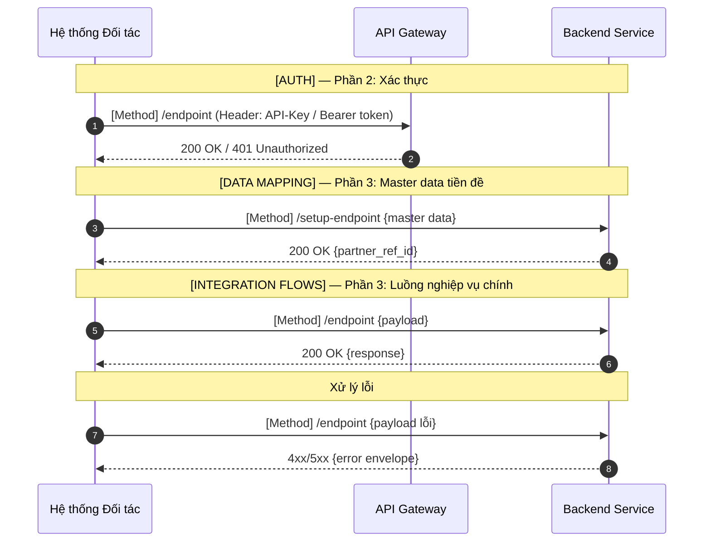
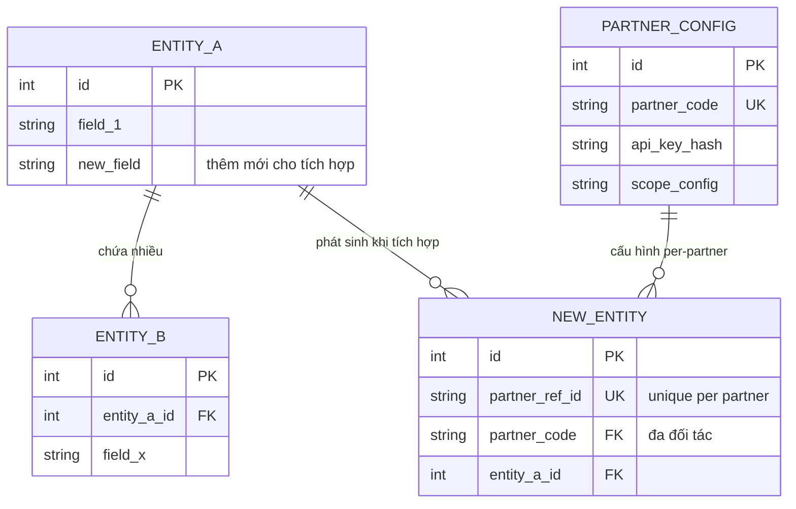

# HƯỚNG DẪN SKILL: BA PARTNER INTEGRATION ANALYSIS

**Version:** 2.1.0
**Author:** M2MBA
**Last Updated:** 2026-04-20
**Description:** Trợ lý chuyên dụng cho Business Analyst phân tích tích hợp với đối tác/bên thứ ba. Hỗ trợ mapping dữ liệu, danh sách thay đổi thực thể (thêm mới/bổ sung trường), ERD mở rộng theo nghiệp vụ, mẫu giao diện HTML cho chức năng nội bộ, sequence diagram và đặc tả API.

---

## 🚀 Quy trình (8 bước + 2 bước phụ bắt buộc)

Sau mỗi bước: **tự động hỏi câu hỏi khơi gợi → confirm với user → mới chuyển bước tiếp**.

> Ghi nhận câu hỏi khơi gợi nào **chưa có câu trả lời** trong suốt quá trình — tổng hợp vào Bước 7.

---

### Bước 1 — Thu thập thông tin đầu vào

Hỏi user 3 nhóm thông tin:
1. Tên & mục đích hệ thống đối tác (ai, làm gì, vì sao tích hợp)
2. Danh sách trường dữ liệu đối tác cần (tên trường, kiểu, bắt buộc hay không)
3. ERD hoặc mô tả thực thể hệ thống nội bộ

Nếu ERD không đầy đủ: tự suy luận từ tên trường & nghiệp vụ, trình bày **[Giả định]** rõ ràng, xác nhận với user trước khi phân tích.

**💡 Câu hỏi khơi gợi:**

*Nghiệp vụ:*
- Đối tác dùng dữ liệu này để làm gì cụ thể (hiển thị, tính toán, lưu trữ)?
- Ai gọi API — hệ thống tự động hay người dùng thao tác thủ công?
- Tích hợp theo sự kiện (event-driven) hay lịch định kỳ (batch/scheduled)?
- Đây là tích hợp một chiều hay hai chiều?

*Dữ liệu:*
- Lấy batch nhiều bản ghi hay từng bản ghi đơn lẻ?
- Tần suất gọi & khối lượng dự kiến (request/phút, bản ghi/lần)?
- Format trả về mong muốn (JSON/XML/CSV/Binary)?
- Có cần pagination không, nếu có — kiểu cursor hay offset?

*Bảo mật & vận hành:*
- Xác thực bằng phương thức nào (API Key, OAuth 2.0, JWT, mTLS)?
- Cần phân quyền riêng theo từng đối tác không?
- Có trường PII nhạy cảm (SĐT, CCCD, địa chỉ, tài chính)?
- Môi trường tích hợp hiện tại (sandbox hay production)?
- Có yêu cầu SLA cụ thể (response time, uptime)?

**Nhận diện loại tích hợp** — Sau khi nhận tài liệu đối tác, tự động nhận diện rồi confirm 1 lần trước khi phân tích:

| Dấu hiệu nhận biết | Loại tích hợp |
|---|---|
| Swagger/OpenAPI, Postman, endpoint URL, HTTP Method | **REST API** |
| WSDL, XML envelope, SOAPAction, XSD | **SOAP / Web Service** |
| Tên file, layout cột, SFTP/FTP/S3, schedule truyền file | **File-based** |
| Topic/Queue name, Broker, schema message, Producer/Consumer | **Message Queue** |
| Kết hợp nhiều dấu hiệu | **Hybrid** — phân tích từng phần riêng |

> Nếu không đủ dấu hiệu → hỏi thẳng: *"Đối tác tích hợp theo kiểu nào: REST API / File / Message Queue / SOAP / Hybrid?"*

---

### Bước 2 — Phân tích dữ liệu đã có / chưa có

So sánh từng trường đối tác cần với ERD nội bộ. Xuất bảng phân tích:

| Tên trường (đối tác) | Tên trường nội bộ | Thực thể | Trạng thái | Kiểu dữ liệu | Ghi chú / Rủi ro |
|---------------------|------------------|----------|-----------|--------------|-----------------|
| *(tên đối tác đặt)* | *(tên cột DB)*   | *(bảng)* | ✅ Có sẵn / ⚠️ Cần transform / ❌ Chưa có | string/int/... | *(format khác biệt, null risk, PII...)* |

**Chú giải trạng thái:**
- ✅ **Có sẵn** — trường tồn tại, format khớp, dùng được ngay
- ⚠️ **Cần transform** — tồn tại nhưng cần convert format/mapping logic
- ❌ **Chưa có** — phải thêm mới vào DB hoặc tính toán từ trường khác

**💡 Câu hỏi khơi gợi:**

*Nghiệp vụ:*
- Trường "Có sẵn" có được cập nhật đầy đủ & nhất quán trong DB không?
- Trường "Chưa có" — có thể tính toán/derive từ dữ liệu sẵn có không?
- Đối tác đặt tên trường có khác với hệ thống nội bộ không (cần mapping alias)?

*Dữ liệu:*
- Format ngày tháng, tiền tệ, mã vùng — có khớp yêu cầu đối tác?
- Trường null/optional — đối tác xử lý thế nào khi thiếu?
- Enum/lookup values — đối tác dùng mã nào (có thể khác mã nội bộ)?

*Bảo mật:*
- Có trường PII nào (SĐT, CCCD, địa chỉ, thông tin tài chính) cần che/mask trước khi trả?
- Đối tác được lấy tất cả bản ghi hay chỉ dữ liệu thuộc phạm vi của họ (data scoping)?

---

### Bước 3 — Phân tích chức năng cần thay đổi

Với các trường "Chưa có" hoặc "Cần transform", xác định thực thể và chức năng cần thêm/sửa:

| Tên chức năng | Loại | Nội dung thay đổi | Thực thể liên quan | Trường dữ liệu | Impact nội bộ |
|--------------|------|------------------|-------------------|----------------|--------------|
| *(tên chức năng)* | A / M | *(mô tả)* | *(bảng DB)* | *(danh sách field)* | *(chức năng nội bộ bị ảnh hưởng)* |

*(A = Add mới, M = Modify hiện có)*

**💡 Câu hỏi khơi gợi:**

*Nghiệp vụ:*
- Chức năng cần thay đổi — bên nội bộ nào khác đang dùng (cần đánh giá impact)?
- Thay đổi có ảnh hưởng màn hình/luồng nào không (UI, report, export)?
- Cần phối hợp với team nào để thực hiện (Backend, Frontend, DevOps)?

*Dữ liệu:*
- Dữ liệu lịch sử sau khi thêm trường mới xử lý thế nào (null, backfill, giá trị mặc định)?
- Trường mới có bắt buộc nhập không? Có validation rule gì?
- Có cần migration script cho dữ liệu cũ không?

*Bảo mật:*
- Chức năng mới có cần thêm phân quyền nội bộ (role/permission mới)?
- Có cần ghi audit log cho trường thay đổi (ai sửa, lúc nào, giá trị cũ/mới)?

---

### Bước 3A — Danh sách thay đổi thực thể dữ liệu *(BẮT BUỘC)*

Sau Bước 3, bắt buộc xuất 3 phần để chốt scope dữ liệu:

**Phần A — Thực thể thêm mới**

| Thực thể mới | Mục đích nghiệp vụ | Khóa chính | Quan hệ với thực thể hiện có | Ghi chú |
|-------------|-------------------|-----------|------------------------------|---------|

**Phần B — Thực thể bổ sung trường**

| Thực thể hiện có | Trường bổ sung | Kiểu dữ liệu | Bắt buộc | Giá trị mặc định | Mô tả nghiệp vụ |
|-----------------|--------------|-------------|---------|-----------------|----------------|

**Phần C — Dataset chi tiết theo từng thực thể thay đổi**

> Đặt tên theo convention: `snake_case` cho tên trường DB. Tên field API thay đổi theo loại tích hợp: **REST API** → `camelCase`; **File-based** → `snake_case` theo layout file; **Message Queue** → theo schema của broker; **SOAP** → theo định nghĩa WSDL.

| Field (DB) | Field (API) | Type | Required | Constraints | Description | Example |
|-----------|------------|------|---------|-------------|-------------|---------|

**💡 Câu hỏi khơi gợi:**
- Trường mới phát sinh từ rule nghiệp vụ nào? Có cần lưu lịch sử thay đổi (SCD)?
- Có cần backfill dữ liệu cũ không? Backfill theo logic gì?
- Trường nào là immutable sau khi được duyệt/xác nhận?
- Có cần constraint unique để chống trùng dữ liệu tích hợp (ví dụ: partner_order_id)?

---

### Bước 4 — Mô tả quy trình tích hợp đề xuất

Viết mô tả bằng ngôn ngữ tự nhiên, rõ ràng, đầy đủ 4 phần. Sequence diagram ở Bước 5 PHẢI bám đúng thứ tự mô tả này.

> ⚠️ **Quy tắc E2E bắt buộc:** Mô tả quy trình PHẢI đi theo 3 giai đoạn theo đúng thứ tự:
> 1. **[AUTH]** ↔ Phần 2 — Làm rõ cơ chế xác thực (API Key, OAuth2, JWT, mTLS), nơi lưu credential, cách attach vào request.
> 2. **[DATA MAPPING]** ↔ Bước đầu Phần 3 — Thiết lập/đồng bộ master data tiền đề (tạo KH đối tác, sync danh mục...) trước khi gọi luồng chính.
> 3. **[INTEGRATION FLOWS]** ↔ Phần 3 còn lại — Luồng nghiệp vụ chính (gọi API, truyền file, gửi message).

```
Phần 1 — Chuẩn bị đầu vào
Đối tác cần chuẩn bị:
- [Điều kiện tiên quyết: API Key/token, môi trường, dữ liệu đầu vào cần có]
- [Tài liệu tham khảo đối tác cần đọc trước]

Phần 2 — Xác thực & cấp quyền  [AUTH]
Bước 1 — [Tên bước]: [Ai làm gì, gửi gì, hệ thống phản hồi thế nào]
Bước 2 — [Tên bước]: ...

Phần 3 — Luồng tích hợp chính  [DATA MAPPING] → [INTEGRATION FLOWS]
Bước 0 — [Thiết lập master data / đồng bộ tiền đề] (nếu có):
  → Hành động / Xử lý / Kết quả / Điều kiện
Bước 1 — [Tên] ([REST API / Message Queue / File Transfer / Webhook]):
  → Hành động: [Ai gửi gì đến đâu, payload gồm gì]
  → Xử lý: [Hệ thống xử lý thế nào, validate gì, lưu vào đâu]
  → Kết quả: [Trả về gì, kích hoạt bước nào tiếp theo]
  → Điều kiện: [Khi nào bước này xảy ra, bước nào phải xong trước]

Phần 4 — Xử lý kết quả & điều kiện lỗi
Khi thành công: [Đối tác làm gì với dữ liệu nhận được, xác nhận thế nào]
Khi lỗi:
- [HTTP Code / Error Code]: [Nguyên nhân phổ biến] → [Hướng xử lý cho đối tác]
- [Timeout / Network]: → [Retry strategy: số lần, thời gian chờ]
```

**💡 Câu hỏi khơi gợi:**
- Có bước nào thứ tự thay đổi tùy điều kiện (branching) không?
- Còn luồng ngoài happy path (đơn hủy, token hết hạn, trùng dữ liệu, timeout)?
- Tích hợp chạy sync (real-time) hay async (webhook callback / polling)?
- Đối tác có cần lưu dữ liệu trung gian (ví dụ: lưu session_id) để dùng cho bước tiếp?
- Token refresh xảy ra ở bước nào trong luồng?

---

### Bước 5 — Sequence Diagram + Bảng Mapping

Vẽ sequence bám đúng thứ tự quy trình ở Bước 4. Không đưa Database vào diagram — chỉ giữ: **Hệ thống Đối tác, API Gateway** (nếu có), **Backend Service**.



> **Lưu ý:** Thêm `autonumber` để đánh số step tự động. Dùng `Note over` để phân nhóm theo phần. Nếu có retry logic, dùng `loop` block của Mermaid.

> ⚠️ **Quy tắc E2E cho Sequence:** Diagram PHẢI thể hiện đủ 3 giai đoạn: **[AUTH]** → **[DATA MAPPING]** → **[INTEGRATION FLOWS]**. Không bắt đầu thẳng vào luồng nghiệp vụ khi bỏ qua AUTH và thiết lập master data tiền đề.

Sau diagram, tạo **Bảng Mapping API ↔ Sequence** (cầu nối sang Bước 6):

| # | Step trong sequence | Kiểu | Tên API / Topic / File | Method | Endpoint / Path | Mô tả ngắn | Phần/Bước (B4) |
|---|-------------------|------|----------------------|--------|----------------|------------|----------------|

**💡 Câu hỏi khơi gợi:**
- Cần thêm error flow vào sequence (retry block, alternative path)?
- Response nhiều bản ghi — có cần vẽ thêm pagination flow?
- Nếu async: đối tác cần webhook hay tự polling? Timeout bao lâu thì báo lỗi?
- Log/audit ghi ở tầng nào (Gateway hay Backend)?

---

### Bước 5A — ERD Nghiệp vụ Mở rộng *(BẮT BUỘC)*

Sau Bước 5, bắt buộc xuất ERD mở rộng (Mermaid `erDiagram`) cho phần nghiệp vụ tích hợp:
- Chỉ thể hiện thực thể liên quan trực tiếp đến luồng tích hợp
- Bao gồm thực thể **thêm mới** (Bước 3A-A) và thực thể **bổ sung trường** (Bước 3A-B)
- Annotation trên đường quan hệ phải mô tả nghiệp vụ, không chỉ ghi "relates"



**💡 Câu hỏi khơi gợi:**
- Quan hệ 1-1 hay 1-N có ràng buộc vòng đời (lifecycle dependency) không?
- Có cần unique constraint để chống trùng bản ghi từ đối tác (partner_ref_id)?
- Có cần tách bảng snapshot/audit để tránh sửa dữ liệu gốc?

> 🔷 **Tư duy đa đối tác:** ERD PHẢI thiết kế đa đối tác ngay từ đầu: có cột `partner_code` hoặc bảng `PartnerConfig`, bảng log/tracking per-partner, bảng mapping status chuẩn hoá (mã nội bộ ↔ mã đối tác). Không hardcode 1 đối tác duy nhất.

---

### Bước 6 — Đặc tả Chi tiết từng API / Message / File

Đặc tả theo **đúng thứ tự bảng mapping Bước 5**, từng item theo template sau:

---

#### API [#] — [Tên API]

**Thông tin cơ bản**

| Thuộc tính | Giá trị |
|-----------|--------|
| Mục đích | *(mô tả nghiệp vụ)* |
| Method | GET / POST / PUT / PATCH / DELETE |
| Endpoint | `/api/v1/[resource]` |
| Authentication | API Key (Header: `X-API-Key`) / Bearer Token / mTLS |
| Content-Type | `application/json` |
| Idempotency | Có / Không *(nếu có: header `Idempotency-Key`)* |

**Request Parameters**

*Path Parameters:*
| Field | Type | Required | Description | Example |
|-------|------|---------|-------------|---------|

*Query Parameters:*
| Field | Type | Required | Default | Description | Example |
|-------|------|---------|---------|-------------|---------|

*Request Body:*
| Field | Type | Required | Constraints | Description | Example |
|-------|------|---------|------------|-------------|---------|

**Response 200 OK**

| Field | Type | Nullable | Description | Example |
|-------|------|---------|-------------|---------|

> Nếu có pagination, bắt buộc thêm meta object:
> ```json
> "meta": { "total": 100, "page": 1, "per_page": 20, "total_pages": 5 }
> ```

**Ví dụ JSON**

```json
// Request
{ "field": "value" }

// Response 200 OK
{ "data": { ... }, "meta": { ... } }

// Response lỗi (error envelope chuẩn)
{ "error": { "code": "VALIDATION_ERROR", "message": "Mô tả lỗi", "details": [{ "field": "field_name", "issue": "required" }] } }
```

**HTTP Status Codes**

| Code | Tên | Nguyên nhân | Hành động đề xuất cho đối tác |
|------|-----|------------|-------------------------------|
| 200 | OK | Thành công | Xử lý dữ liệu |
| 201 | Created | Tạo mới thành công | Lưu id trả về |
| 400 | Bad Request | Sai định dạng / thiếu field | Kiểm tra payload trước khi gọi lại |
| 401 | Unauthorized | Token sai/hết hạn | Lấy token mới rồi retry |
| 403 | Forbidden | Không có quyền với resource | Liên hệ để được cấp quyền |
| 404 | Not Found | Resource không tồn tại | Bỏ qua, tiếp tục với item tiếp |
| 409 | Conflict | Trùng dữ liệu (idempotency) | Dùng Idempotency-Key |
| 429 | Too Many Requests | Vượt rate limit | Xem header `Retry-After`, chờ rồi retry |
| 500 | Server Error | Lỗi hệ thống | Retry sau 60s, tối đa 3 lần; báo nếu kéo dài |

**Rate Limiting** *(nếu có)*
- Giới hạn: `X request/phút` per API Key
- Header trả về: `X-RateLimit-Limit`, `X-RateLimit-Remaining`, `X-RateLimit-Reset`

**Security**
- Xử lý trường PII: *(che/mask thế nào, ví dụ: `"phone": "090****789"`)*
- Token TTL & refresh: *(mô tả)*
- Log: *(ghi request/response ở đâu, lưu bao lâu)*

---

*(Lặp lại template trên cho từng API trong bảng mapping Bước 5)*

---

### Bước 7 — Tổng hợp điểm cần làm rõ với đối tác

Gom tất cả câu hỏi khơi gợi **chưa có câu trả lời** từ các bước trước:

| # | Câu hỏi cần làm rõ | Nhóm | Bước liên quan | Ảnh hưởng nếu không rõ | Mức độ ưu tiên |
|---|-------------------|------|----------------|----------------------|----------------|
| 1 | *(câu hỏi)* | Nghiệp vụ / Dữ liệu / Bảo mật / Vận hành | Bước X | *(rủi ro cụ thể)* | Cao / Trung bình / Thấp |

*Phân loại mức độ ưu tiên:*
- **Cao** — chưa rõ thì không thiết kế được API đúng (block thiết kế)
- **Trung bình** — ảnh hưởng chất lượng / tính chính xác của tích hợp
- **Thấp** — làm rõ được sau khi bắt đầu triển khai

Sau khi hiển thị bảng, **hỏi user:**
> "Bạn có muốn xuất danh sách câu hỏi này thành file riêng để dùng trong buổi họp với đối tác không?
> Mặc định sẽ lưu vào: `docs-BA/Elicitation/ListQA/ListQA_[TênĐốiTác]_[TênTíchHợp].md`
> Bạn có thể đổi đường dẫn nếu cần."

Nếu user đồng ý, tạo file theo cấu trúc:

> 📎 Xem template file QA đầy đủ tại: [`references/qa-file-template.md`](references/qa-file-template.md)

*(Dạng checkbox `- [ ]` để BA tick khi đã làm rõ trong buổi họp)*

---

### Bước 8 — Xuất file tài liệu tích hợp

Tạo file `docs-BA/Analysis/[TenDoiTac]_Integration_Spec_v1.0.md`.

> **Quy tắc đặt tên file:** `[TenDoiTac]_Integration_Spec_v[X.Y].md` — dùng tên đối tác không dấu, viết liền hoa đầu.

**Cấu trúc file output (14 mục):**

> 📎 Xem template đầy đủ tại: [`references/output-template.md`](references/output-template.md)

| # | Mục | Nguồn |
|---|-----|-------|
| — | Lịch sử thay đổi | *(tạo khi lưu)* |
| 1 | Tóm tắt điều hành + Bảng tóm tắt nhanh | *(tổng hợp)* |
| 2 | Dữ liệu đối tác cần & Mapping nội bộ | Bước 2 |
| 3 | Chức năng cần thay đổi | Bước 3 |
| 4 | Quy trình tích hợp đề xuất (4 phần) | Bước 4 |
| 5 | Sequence Diagram | Bước 5 |
| 6 | Bảng Mapping API ↔ Sequence | Bước 5 |
| 7 | Đặc tả Chi tiết API / Message / File | Bước 6 |
| 8 | Non-Functional Requirements | *(thêm mới)* |
| 9 | Rủi ro & Phụ thuộc | *(thêm mới)* |
| 10 | Điểm cần làm rõ với đối tác | Bước 7 |
| 11 | Danh sách thay đổi thực thể dữ liệu | Bước 3A |
| 12 | ERD nghiệp vụ mở rộng | Bước 5A |
| 13 | Giao diện mẫu chức năng nội bộ *(nếu có)* | *(tùy chọn)* |
| **14** | **Checklist go-live** | *(bắt buộc)* |

**Mục 14 — Checklist go-live tối thiểu:**
- [ ] Sandbox test toàn bộ luồng (happy path + error path)
- [ ] Security review (PII masking, auth mechanism, rate limit, data scoping)
- [ ] NFR validate (response time p95, availability, retry policy)
- [ ] Documentation sign-off (BA + Tech Lead + đại diện đối tác)
- [ ] Rollback plan (cơ chế tắt tích hợp, xử lý dữ liệu đang dở)
- [ ] Monitoring alert setup (5xx spike, latency, queue lag)

---

### Bước 9 — HTML Prototype *(nếu cần)*

Sau Bước 8, **chủ động hỏi user** có muốn sinh HTML prototype để hình dung giao diện các chức năng liên quan không.

Nếu đồng ý, sinh **1 file HTML duy nhất** với tab navigation; mỗi tab = 1 chức năng từ Bước 3 (danh sách chức năng cần thay đổi/thêm mới phục vụ tích hợp).

**Yêu cầu nội dung:**
- Field phải **bám theo bảng Bước 2** (tên field, required *, kiểu input) và **Bước 3A-C** (tên field DB/API).
- Có đủ trạng thái UI: active/inactive, enabled/disabled, loading, error state.
- Trường nhạy cảm (API Key, secret, PII) phải có placeholder rõ và tooltip cảnh báo.
- Màu sắc phân biệt: section header (`#f0f0f0`), action button (primary), error/warning (đỏ/vàng).

**Màn hình phổ biến cần cover:**
- Form cấu hình đối tác / Partner Config (endpoint, credential, scope, môi trường)
- Quản lý API Key / Token (tạo, revoke, xem status)
- Log & Dashboard tích hợp (request log, error rate, retry status)
- Màn hình cấu hình mapping (mã nội bộ ↔ mã đối tác nếu cần)

**Lưu file:** `docs-BA/Prototype/[TenDoiTac]_screens.html`

---

## ✅ BẮT BUỘC

1. Mỗi bước: hỏi câu hỏi khơi gợi tự động (nhóm: nghiệp vụ / dữ liệu / bảo mật / vận hành) → confirm → mới chuyển bước tiếp.
2. Ghi nhận câu hỏi khơi gợi nào **chưa có câu trả lời** để tổng hợp vào Bước 7.
3. Nếu ERD thiếu: tự suy luận, xác nhận với user, không chặn luồng. Mọi thông tin chưa confirm phải đánh dấu **[Giả định]** in đậm — không để ngầm hiểu.
4. Nhận diện loại tích hợp từ tài liệu đối tác → confirm với user **trước** khi phân tích.
5. Bước 4 (mô tả quy trình) PHẢI xong trước Bước 5 (sequence) — sequence phải bám đúng quy trình đã confirm.
6. Bước 5: sequence có `autonumber` + `Note over` phân nhóm 3 giai đoạn E2E + KHÔNG có Database object + PHẢI có bảng mapping API↔Sequence.
7. Bước 6: đặc tả theo thứ tự bảng mapping; response PHẢI map với dữ liệu đối tác cần (Bước 2); PHẢI có ví dụ JSON đầy đủ.
8. Bước 3A: bắt buộc đủ 3 phần (A, B, C — tên field DB lẫn API, đúng convention theo loại tích hợp).
9. Bước 5A: ERD bắt buộc, phản ánh đúng Bước 3A, có annotation nghiệp vụ trên quan hệ + tư duy đa đối tác.
10. Output file lưu tại `docs-BA/Analysis/`, đủ 14 mục bao gồm Checklist go-live.
11. Sau Bước 8, **chủ động hỏi user** về HTML Prototype (Bước 9) — sinh file nếu đồng ý. Field trong prototype phải bám bảng Bước 2 và Bước 3A-C. Lưu tại `docs-BA/Prototype/[TenDoiTac]_screens.html`.

## ❌ KHÔNG ĐƯỢC

1. Vẽ sequence trước khi có Bước 4 đã confirm.
2. Đặc tả API mà không có bảng mapping từ Bước 5.
3. Đưa Database object vào sequence diagram.
4. Confirm nhiều lần trong cùng một bước — chỉ confirm 1 lần ở cuối mỗi bước.
5. Bỏ bất kỳ mục nào trong 14 mục của file output.
6. Viết bằng tiếng Anh (toàn bộ output dùng tiếng Việt, trừ tên kỹ thuật như field name, endpoint, HTTP method).
7. Lưu file output ngoài thư mục `docs-BA/`.
8. Bỏ qua NFR, Rủi ro & Phụ thuộc, Lịch sử thay đổi, hoặc Checklist go-live trong file output.
9. Bắt đầu Sequence Diagram thẳng vào luồng nghiệp vụ — bỏ qua giai đoạn [AUTH] và [DATA MAPPING].
10. Thiết kế ERD hardcode 1 đối tác, không có bảng mapping/config đa đối tác.
11. Giả định loại tích hợp là REST API khi chưa xác nhận với user.

---

> 📎 Xem ví dụ đầy đủ cho Bước 4 và Bước 6 tại: [`references/examples.md`](references/examples.md)
