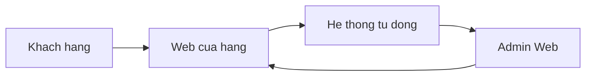

# Tong quan he thong: Vi du Mini-Shop

## 1. Tong quan he thong

He thong ho tro ban hang truc tuyen voi don hang, san pham va nguoi dung. Du lieu trong tam: `User`, `Product`, `Order`, `OrderItem`.

**Phu thuoc dau vao:** `docs-BA/Data Model/ba-data-model_mini-shop.md` (gia dinh).

## 2. Danh sach doi tuong su dung

| STT | Doi tuong (Actor) | Mo ta / vai tro | Ghi chu |
|-----|-------------------|-----------------|--------|
| 1 | Khach hang | Xem san pham, dat hang | |
| 2 | Quan tri vien | Quan ly san pham va don | |

## 3. Danh sach ung dung

| STT | Ten ung dung | Muc dich | Ghi chu |
|-----|--------------|----------|--------|
| 1 | Web cua hang | Mua hang | |
| 2 | Admin Web | Van hanh noi bo | |

## 4. Quy trinh nghiep vu

#### 4.1 Dat hang va xac nhan

**Phan A — Luong thuc hien:**

| Buoc | Nguoi thuc hien | Ung dung | Ten chuc nang | Mo ta |
|------|-----------------|----------|---------------|-------|
| 1 | Khach hang | Web cua hang | Gio hang & thanh toan | Tao `Order`, `OrderItem`; tinh tong tien tu `Product.price` |
| 2 | He thong | He thong / tu dong | Xac nhan don | Cap nhat `Order.status = CONFIRMED` (gia dinh - can xac nhan) |
| 3 | Quan tri vien | Admin Web | Duyet don | Doi `Order.status = APPROVED`; ghi nhan nguoi duyet |

**Phan B — Data Model lien quan:**

| Bang / Thuc the | Vai tro trong quy trinh | Truong lien quan chinh | Ghi chu |
|-----------------|------------------------|------------------------|---------|
| `Order` | Luu trang thai don hang qua tung buoc duyet; la bang trung tam cua quy trinh | `status`, `total_amount`, `updated_at`, `approved_by` | `approved_by` can xac nhan co ton tai trong schema |
| `OrderItem` | Ghi nhan tung san pham trong don; tinh tong tien | `product_id`, `quantity`, `unit_price` | |
| `Product` | Cung cap gia goc de tinh `OrderItem.unit_price` | `price`, `name` | Chi doc, khong ghi trong quy trinh nay |
| `User` | Xac dinh Khach hang dat don va Quan tri vien duyet | `id`, `email`, `role` | |

> **Goi y Mermaid:** Quy trinh co 2 actor + 2 ung dung tuong tac -> du dieu kien them Context Diagram o Phu luc.

## 5. Danh sach chuc nang theo ung dung

> Tong dong = 4 (< 30) -> dung bang tong. Khi > 30 dong: tach **5.1, 5.2...** theo ung dung.

| Ung dung | Actor | Ten chuc nang | Loai thao tac | Mo ta chuc nang | Bang du lieu lien quan | Truong du lieu lien quan |
|----------|-------|---------------|---------------|-----------------|------------------------|--------------------------|
| Web cua hang | Khach hang | Xem danh muc san pham | R | Hien thi san pham theo danh muc | `Product` | `id`, `name`, `price`, `category` |
| Web cua hang | Khach hang | Dat hang | W | Tao Order + OrderItem | `Order`, `OrderItem` | `Order.status`, `OrderItem.quantity`, `OrderItem.product_id` |
| Admin Web | Quan tri vien | Quan ly don hang | RW | Xem danh sach, duyet/huy don | `Order`, `OrderItem`, `User` | `Order.status`, `Order.updated_at`, `User.email` |
| Admin Web | Quan tri vien | Quan ly san pham | RW | Tao, sua, vo hieu hoa san pham | `Product` | `Product.*` |

- **Bang chua gan chuc nang (can lam ro):** (khong - vi du da phu `Product`, `Order`, `OrderItem`, `User`)
- **Truong chua phu (can lam ro):** `Order.deleted_at` - soft delete, chua co chuc nang khoi phuc don hang.

---

## Phu luc: Context Diagram (tuy chon)

